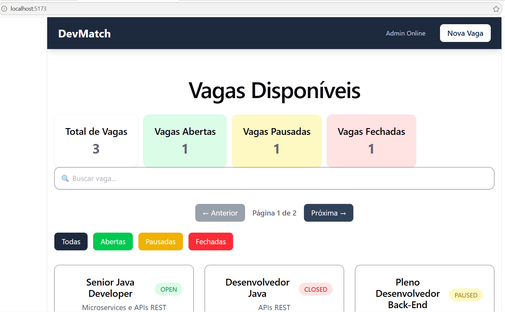

# 🚀 DevMatch

Aplicação **fullstack** desenvolvida para gerenciar e conectar usuários através de uma plataforma web moderna,  
com backend robusto em **Spring Boot** e frontend interativo.

---

## 📌 Sobre o Projeto

O **DevMatch** é um sistema que permite o cadastro, consulta e gerenciamento de usuários,  
com integração entre frontend e backend via API REST.

Este projeto foi desenvolvido com foco em:

- ✅ Arquitetura fullstack
- ✅ Boas práticas de desenvolvimento
- ✅ Organização de código
- ✅ Segurança com variáveis de ambiente

---

## 🛠️ Tecnologias Utilizadas

### 🔙 Backend
- Java 17+
- Spring Boot
- Maven
- API REST

### 🎨 Frontend

O frontend é responsável pela interface do usuário, permitindo a interação com a API do sistema.

Foi desenvolvido com:

- React
- Vite
- JavaScript
- HTML5 e CSS3
- Axios

#### 📌 Principais responsabilidades:

- ✅ Exibir dados da API
- ✅ Permitir cadastro de usuários
- ✅ Consumir endpoints do backend
- ✅ Gerenciar estado da aplicação

---

## 📸 Interface



---

## 🔗 Comunicação com o Backend

O frontend se comunica com o backend através de requisições HTTP.

A URL da API pode ser configurada via variável de ambiente:

```env
VITE_API_URL=http://localhost:8080

